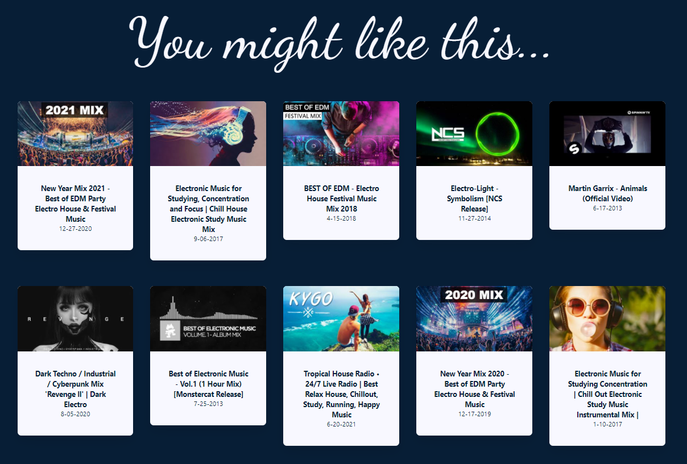
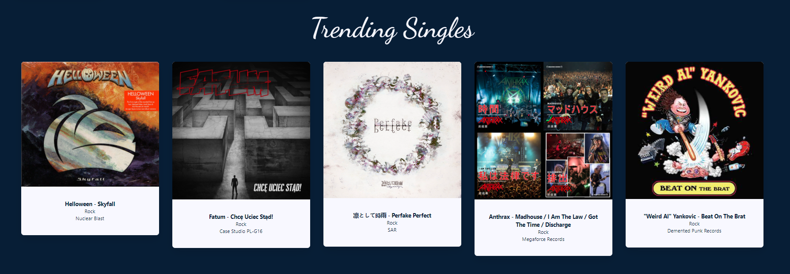
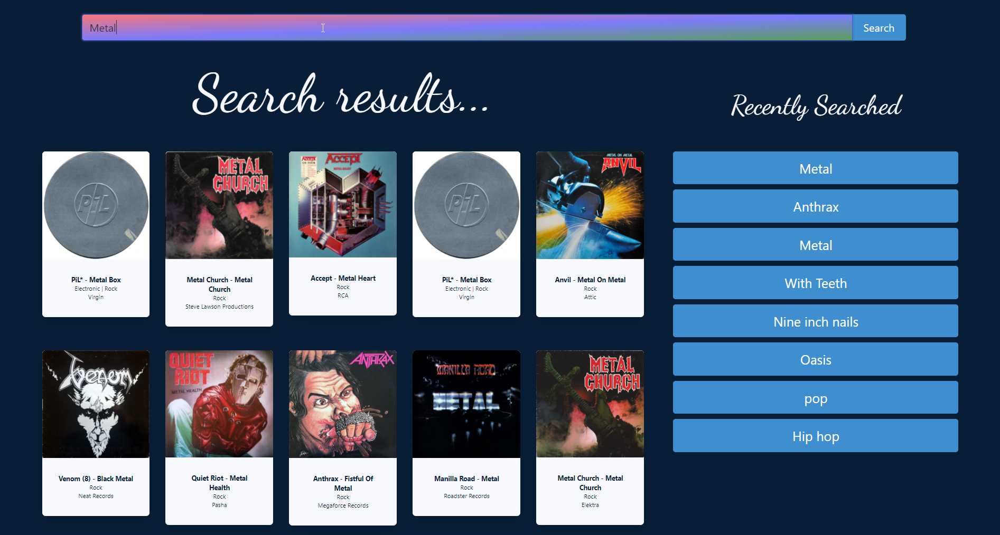
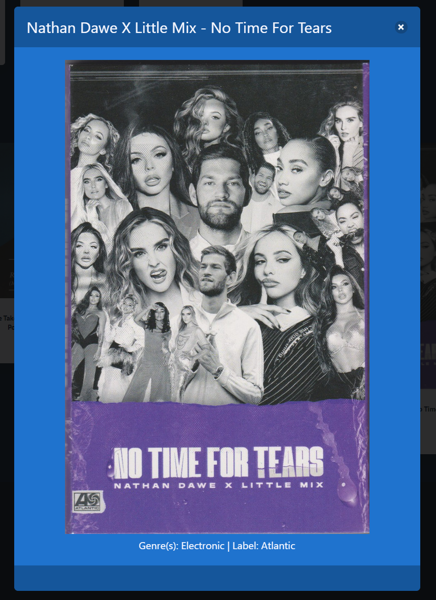
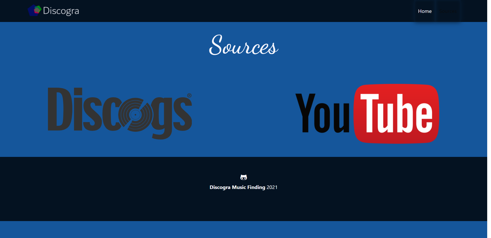

# Discogra: A Music and Discography Finding Tool

Discogra is a tool using the [Discogs.com API](https://www.discogs.com/developers) and the [YouTube API](https://developers.google.com/youtube/v3/docs/search/list) to help users find music they are interested in. 

It uses the following technologies.

* [Discogs.com API](https://www.discogs.com/developers) and [YouTube API](https://developers.google.com/youtube/v3/docs/search/list) for music and genre searching
* [Bulma CSS Library](https://bulma.io/) for styling and layout
    * [Bulma Cards Template](https://github.com/BulmaTemplates/bulma-templates/blob/master/templates/cards.html)
* [Moment.js](https://momentjs.com/) to work with time
* [Font Awesome](https://fontawesome.com/) and [Google Fonts](https://fonts.google.com/) for the github icon and font styling

It has the following functionality.

* Connect to two server side APIs and renders dynamic results based on user entry
* Utilizes the open source CSS library [Bulma](https://github.com/jgthms/bulma)
* Utilizes local storage to store persistent user data such as saving of users input and data including genres related to searches and previous search history
* Customized Bulma Modal to show details of results from the Discogs API
* Using fetch for AJAX calls to pull data and DOM manipulation for responsive data rendering
* Trending Singles that default to the rock genre but once the users enter searches random associated genres of music will show
* Similarly by default YouTube videos are shown in the 'you might like this...' section with a default of 'Top 40' but a genre related to searches the user makes will be shown after search results exist
* The ability to search for bands, albums and genres
* An interactive saved search history of previous searches

It can be seen live here: https://davidtunnell.github.io/music-discography-multiple-third-party-apis/

# Screenshots

## Main

## Dynamic YouTube Recommendations

## Dynamic Discog Single Recommendations

## Search Results

## Saved Recent Searches

## Details Modal for Discogs Results

## Sources Page

